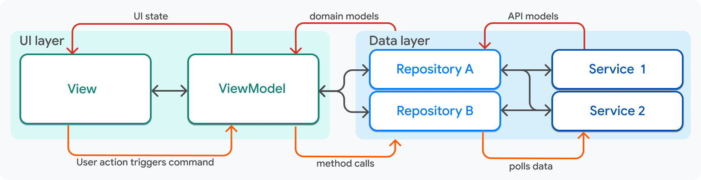

# Flutter ハンズオン

## Flutter とは

Flutterは、Googleによって開発されたオープンソースのUIフレームワークです。単一のコードベースから、iOS、Android、Web、Windows、macOS、Linuxといった複数のプラットフォーム向けに、ネイティブコンパイルされた高品質なアプリケーションを構築できます。

### Flutter と Dart の関係

Flutter アプリケーションは **Dart** という言語で記述されます。

- **エンジンの役割**: Flutter は UI 描画エンジン（Skia や Impeller）、ライブラリ、ツールセットを提供します。
- **言語の役割**: Dart はそのエンジン上で動くロジックや UI の構成を記述するためのプログラミング言語です。

Flutter が Dart を採用している主な理由は、以下の 2 つのコンパイル方式をサポートしている点にあります。
1. **JIT (Just-in-Time) コンパイル**: 開発中に使用されます。これにより「Hot Reload」が可能になり、コードの変更を秒単位でシミュレータや実機に反映できます。
2. **AOT (Ahead-of-Time) コンパイル**: リリース時に使用されます。コードを各プラットフォームのネイティブマシンコードに事前に変換するため、非常に高速な起動とスムーズなパフォーマンスを実現します。

### Dart について

Dart は「あらゆるプラットフォームで高速に動作するアプリ」を作るために最適化された、クライアント向けのオブジェクト指向言語です。

- **習得のしやすさ**: Java、JavaScript、C# などに近い構文（C-style syntax）を持っており、他の言語経験者にとって非常に親しみやすい言語です。
- **強力な型システム**: 健全な型システム（Sound Type System）と静的解析により、実行前のエラー検知が容易です。
- **Null Safety**: 変数が null かどうかを厳密に扱うことで、アプリのクラッシュの主な原因となる null 参照エラーを未然に防ぎます。

## Widget（ウィジェット）とは

Flutter の UI 構築における核心的な概念が「**Widget（ウィジェット）**」です。

### 「すべてがウィジェット」

Flutter では、ボタンやテキストのような目に見える部品だけでなく、レイアウト（余白や配置）、色、テーマ、アニメーションまでもがウィジェットとして定義されます。

ウィジェットは**不変（Immutable）**であり、現在の「アプリの状態」に基づいた UI の「構成情報（設計図）」を保持します。状態が変化すると、Flutter は新しいウィジェットを生成し、古いものと効率的に比較（Diffing）して、最小限のコストで画面を更新します。

### ウィジェットの記述例

以下は、いくつかの基本的なウィジェットを組み合わせた例です。

```dart
// 中央にアイコンとテキスト、ボタンを縦に並べる例
Center(
  child: Padding(
    padding: EdgeInsets.all(16.0),
    child: Column(
      mainAxisSize: MainAxisSize.min,
      children: [
        Icon(Icons.flutter_dash, size: 50, color: Colors.blue),
        Text(
          'Hello Flutter',
          style: TextStyle(fontSize: 24, fontWeight: FontWeight.bold),
        ),
        ElevatedButton(
          onPressed: () => print('Pressed!'),
          child: Text('Click Me'),
        ),
      ],
    ),
  ),
)
```

- **Center / Padding**: 配置や余白を制御します。
- **Column**: 子要素を「縦」に並べます（横は **Row**）。
- **Icon / Text**: 画像や文字を表示します。
- **ElevatedButton**: ユーザーがタップできるボタンを提供します。

### Stateless と Stateful

ウィジェットには大きく分けて 2 つの種類があります。
- **StatelessWidget**: 状態を持たないウィジェット。外部から渡されたデータが変わらない限り、見た目は固定です。
- **StatefulWidget**: 内部に「状態（State）」を持つウィジェット。ユーザーの操作（ボタン押下など）やデータの変化に応じて、自分自身の表示を更新できます。

---

# handson_pub_dev

pub.dev のパッケージ検索アプリを、コメントアウト解除で完成させる Flutter ハンズオンです。

## なぜ階層を分けるのか

アプリのコードは、画面が小さいうちは 1 ファイルにまとめても動きます。
しかし、UI、状態、API 通信、JSON 変換が同じ場所に混ざると、どこを直せばよいか分かりにくくなります。

このハンズオンでは、主に次の考え方を学ぶために階層を分けます。

- UI と State の分離
- 単一責任
- 原因究明しやすい構成
- 変更範囲を小さく保つ構成

UI は画面を描画する責任を持ちます。
State は画面が表示するデータや状態を持ちます。
API 通信は外部からデータを取得する責任を持ちます。
Model は JSON を Dart の型として扱う責任を持ちます。

責任を分けることで、画面が崩れたのか、状態更新が間違っているのか、API 通信に失敗しているのかを切り分けやすくなります。

## アーキテクチャとは

アーキテクチャは、コードをどの責任に分け、どの順番でデータを流すかを決める設計方針です。

Flutter アプリでは、画面、状態、通信、データ変換がそれぞれ別の責任を持ちます。
アーキテクチャを決めることで、ファイルが増えても「どこに何を書くか」を判断しやすくなります。

## MVVM + Repository とは

Google は Flutter アプリの構成として、MVVM + Repository のような責任分離を推奨しています。



MVVM + Repository では、主に次のように責任を分けます。

- View: UI を描画する
- ViewModel: UI に必要な State と操作を持つ
- Repository: データ取得元を隠蔽する
- Service / DataSource: API や DB など実際の取得処理を行う
- Model: データ構造を型として表す

この形は、大きなアプリや複数のデータ取得元があるアプリでは強力です。
一方で、ハンズオンの題材としてはファイル数と横断箇所が増えやすく、初学者が全体像を追いにくくなることがあります。

## 今回の構成

このハンズオンでは、MVVM + Repository をそのまま細かく実装するのではなく、次の粒度にしています。

```txt
ui/
  screen.dart
  view_model.dart
  components/
provider/
  dio/
  search/
  package/
model/
  search/
  package/
router/
```

`ui/` は画面と画面部品を持ちます。
`view_model.dart` は画面に必要な State と操作を持ちます。
`provider/` は API クライアントや API 呼び出しを提供します。
`model/` は API レスポンスを Dart の型として扱います。
`router/` は画面遷移をまとめます。

Repository 層を独立させていない理由は、今回のアプリではデータ取得元が pub.dev API だけで、Repository を作るメリットよりもファイル横断のコストが大きいからです。

## AI とアーキテクチャ

アーキテクチャは、もともと人間が理解しやすくするためのものです。
AI は大量のコードを読めますが、責任ごとに細かく分離しすぎると、編集時に多くのファイルを横断する必要があります。

そのため、AI に作業させる前提では、細かすぎる分離は無駄な編集や確認を増やすことがあります。
一方で、まったく分けないと、人間が原因を追いにくくなります。

このハンズオンでは、人間が理解しやすく、AI が編集するときにも横断が増えすぎない中間の形として、UI、ViewModel、Provider、Model、Router に分けています。

## Riverpod とは

Riverpod は、Flutter で状態や依存関係を管理するためのライブラリです。

画面から直接 API クライアントを作ったり、画面の中に状態更新ロジックを書いたりすると、UI とロジックが混ざります。
Riverpod を使うと、UI は `ref.watch` で状態を読み、`ref.read` で操作を呼び出す形にできます。

これにより、UI は表示に集中し、状態更新や API 呼び出しは ViewModel や Provider に分けられます。

## なぜ Provider がいるのか

Provider は、必要なものを必要な場所へ渡すための仕組みです。

このアプリでは、次のようなものを Provider として扱います。

- API クライアント
- パッケージ検索処理
- パッケージ詳細取得処理
- 画面の ViewModel

Provider を使うことで、画面が API クライアントの作り方を知る必要がなくなります。
また、ViewModel が UI の外側で State を持てるため、UI と State の分離につながります。

Flutter と Riverpod の文脈では、ViewModel を Provider として公開する形が自然です。
画面は ViewModel の State を監視し、ボタン操作などで ViewModel のメソッドを呼び出します。

## 構成

```txt
lib/
  main.dart
  app.dart
  complete/
  handson/
```

- `lib/complete/`: 完成系アプリ
- `lib/handson/`: コメントアウト解除用アプリ
- `lib/app.dart`: 完成系とハンズオン用の切り替え

## 切り替え

完成系アプリを使う場合は `lib/app.dart` を次の状態にします。

```dart
export 'complete/app.dart';

// export 'handson/app.dart';
```

ハンズオン用アプリを使う場合は `lib/app.dart` を次の状態にします。

```dart
// export 'complete/app.dart';

export 'handson/app.dart';
```

## 1. hello world の確認

`lib/app.dart` をハンズオン用に切り替えます。

対象ファイル:

- `lib/app.dart`
- `lib/handson/app.dart`

ファイルの役割:

- `lib/app.dart`: 完成系アプリとハンズオン用アプリを export で切り替える入口です。
- `lib/handson/app.dart`: ハンズオン用アプリの最初の Widget を定義します。この時点では Hello World を表示するだけの最小構成です。

実行します。

```sh
flutter run
```

## 2.1. UI の作成

`STEP 2.1` のコメントアウトを解除します。

対象ファイル:

- `lib/handson/ui/home/screen.dart`
- `lib/handson/ui/home/components/search_field.dart`

ファイルの役割:

- `lib/handson/ui/home/screen.dart`: 検索画面全体を組み立てるファイルです。AppBar、検索欄、検索ボタン、検索結果一覧を配置します。
- `lib/handson/ui/home/components/search_field.dart`: 検索キーワードを入力する TextField だけを担当する画面部品です。

このステップで見るポイント:

- 画面全体を作る `screen.dart` と、小さな UI 部品を作る `components/` を分けます。
- UI 部品を分けることで、画面全体のコードが長くなりすぎるのを防ぎます。
- 入力欄そのものの見た目や設定は `search_field.dart` に閉じ込めます。

この時点では後続ステップのファイルも必要になるため、次のステップへ進みます。

## 2.2. Router の用意

`STEP 2.2` のコメントアウトを解除します。

対象ファイル:

- `lib/handson/app.dart`
- `lib/handson/router/router.dart`

ファイルの役割:

- `lib/handson/app.dart`: `MaterialApp` を `MaterialApp.router` に変更し、アプリ全体で Router を使えるようにします。
- `lib/handson/router/router.dart`: アプリ内の画面遷移ルールをまとめます。どの URL パスでどの画面を表示するかを定義します。

このステップで見るポイント:

- 画面遷移を各画面に直接書き散らさず、`router/` にまとめます。
- `go_router` を使うことで、`/` や `/details` のようなパスで画面を管理できます。
- 詳細画面へ渡す `packageName` は、検索結果タップ時に `extra` として渡します。

`lib/handson/app.dart` は Hello World 用の `MyApp` をコメントアウトし、`STEP 2.2` の `MyApp` を使います。

## 2.3. UI の作成 2

`STEP 2.3` のコメントアウトを解除します。

対象ファイル:

- `lib/handson/ui/home/components/search_list.dart`
- `lib/handson/ui/details/screen.dart`
- `lib/handson/ui/details/components/package_header.dart`
- `lib/handson/ui/details/components/version_list.dart`

ファイルの役割:

- `lib/handson/ui/home/components/search_list.dart`: 検索結果の一覧表示を担当します。パッケージ名を一覧にし、タップ時に詳細画面へ遷移します。
- `lib/handson/ui/details/screen.dart`: 詳細画面全体を組み立てます。読み込み中、エラー、データ表示の状態ごとに UI を切り替えます。
- `lib/handson/ui/details/components/package_header.dart`: パッケージ詳細の上部情報を表示します。名前、バージョン、説明、リポジトリ、ホームページ、トピックを扱います。
- `lib/handson/ui/details/components/version_list.dart`: パッケージのバージョン一覧を表示します。

このステップで見るポイント:

- 一覧画面と詳細画面を分けることで、画面ごとの責任がはっきりします。
- 詳細画面の中でも Header と VersionList を分け、1 つの Widget が大きくなりすぎないようにします。
- `screen.dart` は画面全体の構成、`components/` は再利用しやすい小さな表示部品を担当します。

## 3. model 作成

`STEP 3` のコメントアウトを解除します。

対象ファイル:

- `lib/handson/model/search/model.dart`
- `lib/handson/model/package/model.dart`

ファイルの役割:

- `lib/handson/model/search/model.dart`: pub.dev の検索 API レスポンスを Dart の型として定義します。検索結果一覧で使う `SearchResponse` と `Package` を扱います。
- `lib/handson/model/package/model.dart`: pub.dev のパッケージ詳細 API レスポンスを Dart の型として定義します。詳細画面で使うパッケージ情報、バージョン情報、pubspec 情報を扱います。

このステップで見るポイント:

- API から返る JSON をそのまま UI で扱わず、Model に変換します。
- Model を作ることで、UI や ViewModel は型のあるデータとして安全に扱えます。
- Freezed と json_serializable を使うため、コメントアウト解除後に生成ファイルを作る必要があります。

build_runner を実行します。

```sh
dart run build_runner build --delete-conflicting-outputs
```

## 4. Provider の作成

`STEP 4` のコメントアウトを解除します。

対象ファイル:

- `lib/handson/provider/dio/provider.dart`
- `lib/handson/provider/search/provider.dart`
- `lib/handson/provider/package/provider.dart`

ファイルの役割:

- `lib/handson/provider/dio/provider.dart`: pub.dev API へアクセスするための Dio クライアントを提供します。baseUrl やタイムアウトなど、通信の共通設定を持ちます。
- `lib/handson/provider/search/provider.dart`: 検索 API を呼び出し、`SearchResponse` に変換して返します。
- `lib/handson/provider/package/provider.dart`: パッケージ詳細 API を呼び出し、`PackageDetailResponse` に変換して返します。

このステップで見るポイント:

- UI から直接 Dio を呼ばず、Provider 経由で API 処理を呼び出します。
- API ごとに Provider を分けることで、検索の処理と詳細取得の処理を別々に追いやすくします。
- 通信設定は `dio/provider.dart` に集約し、各 API Provider は必要な endpoint と Model 変換に集中します。

build_runner を実行します。

```sh
dart run build_runner build --delete-conflicting-outputs
```

## 5. ViewModel の作成

`STEP 5` のコメントアウトを解除します。

対象ファイル:

- `lib/handson/ui/home/view_model.dart`
- `lib/handson/ui/details/view_model.dart`

ファイルの役割:

- `lib/handson/ui/home/view_model.dart`: 検索画面の State と操作を持ちます。検索中かどうか、検索結果の一覧、検索ボタンが押されたときの処理を管理します。
- `lib/handson/ui/details/view_model.dart`: 詳細画面の State と操作を持ちます。画面に渡されたパッケージ名をもとに詳細 API を呼び出し、画面が表示するデータを用意します。

このステップで見るポイント:

- UI は `ref.watch` で ViewModel の State を見ます。
- ボタン操作などのイベントは ViewModel のメソッドに渡します。
- ViewModel が Provider を呼び出すことで、UI は API 通信の詳細を知らなくてよくなります。
- Flutter と Riverpod では、画面ごとの State と操作を ViewModel として Provider 化すると、UI と State の分離が分かりやすくなります。

build_runner を実行します。

```sh
dart run build_runner build --delete-conflicting-outputs
```

## 6. 実行の確認

実行します。

```sh
flutter run
```

検索画面で pub.dev のパッケージを検索し、検索結果をタップして詳細画面へ遷移できれば完了です。

確認する流れ:

- `lib/app.dart` が `handson/app.dart` を export していることを確認します。
- 検索画面でキーワードを入力します。
- Search ボタンを押して検索結果が表示されることを確認します。
- 検索結果をタップして詳細画面へ遷移することを確認します。
- 詳細画面でパッケージ概要とバージョン一覧が表示されることを確認します。

## 7. 発展課題

UI を自分で綺麗にします。
